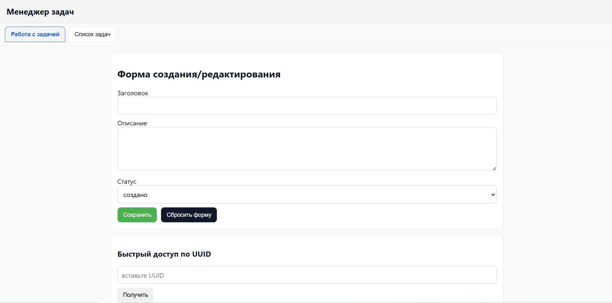
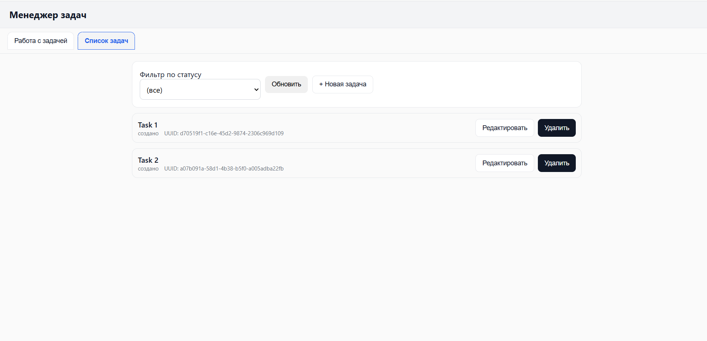

# 🧠 Task Manager — Менеджер задач (FastAPI + SQLite)

Полноценное тестовое приложение для управления задачами.  
Разработано с использованием **FastAPI**, **SQLAlchemy**, **Pydantic**.  
Проект демонстрирует умение строить REST API, работать с БД и связывать backend + frontend без лишних фреймворков.

---

## 🚀 Функционал
✅ CRUD для задач: создание, чтение, обновление, удаление  
✅ Поддержка статусов: **создано**, **в работе**, **завершено**  
✅ Хранение в SQLite через SQLAlchemy ORM  
✅ Интерактивный интерфейс без React/Vue  
✅ Фильтрация и поиск по UUID  
✅ Swagger-документация на `/docs`  

---

## 🧩 Технологии
- Python 3.10+
- FastAPI
- SQLAlchemy
- Jinja2
- HTML, CSS, Vanilla JS
- Uvicorn (ASGI сервер)

---

## 📂 Структура проекта
 ```text
app/
├── routers/ # маршруты API
├── static/ # JS и CSS
├── templates/ # HTML-шаблоны
├── crud.py # операции с БД
├── database.py # подключение к SQLite
├── enums.py # перечисления статусов
├── models.py # ORM-модели
├── schemas.py # Pydantic-схемы
└── main.py # точка входа FastAPI
```
---

## ⚙️ Установка и запуск

```bash
# Клонирование
git clone https://github.com/ilyaign17/task-manager.git
cd task-manager

# Создание окружения
python -m venv .venv
.venv\Scripts\activate  # Windows

# Установка зависимостей
pip install -r requirements.txt

# Запуск сервера
uvicorn app.main:app --reload

📍 После запуска открой:
http://127.0.0.1:8000 — интерфейс приложения
```

---

## 💻 Скриншоты интерфейса

**Вкладка работы с задачами**



**Список задач**


